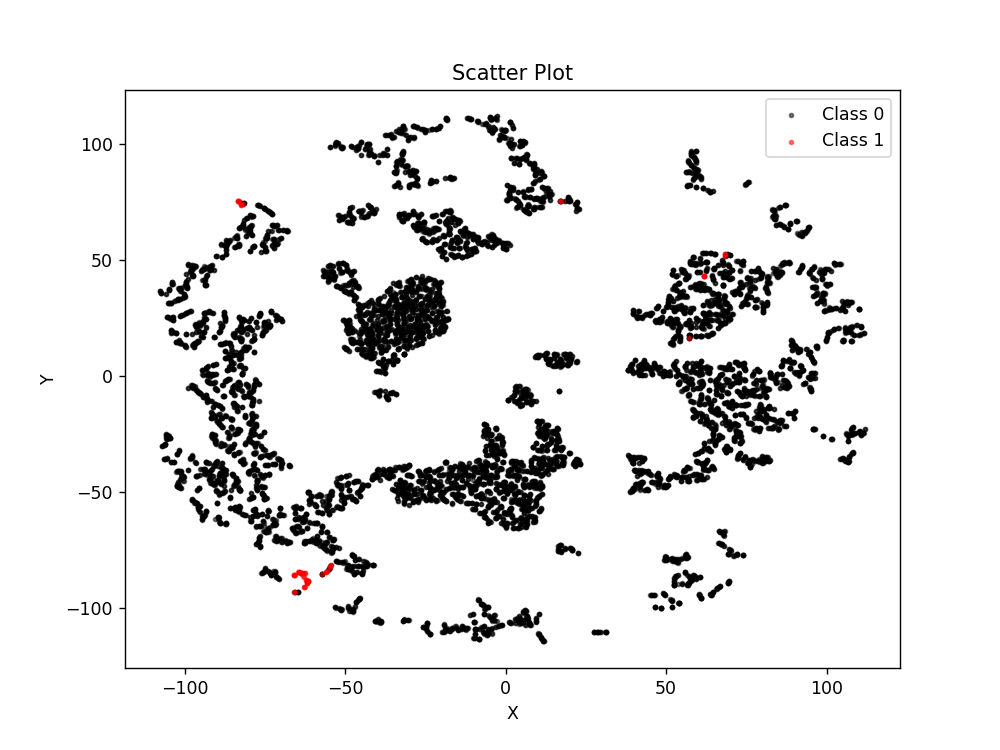
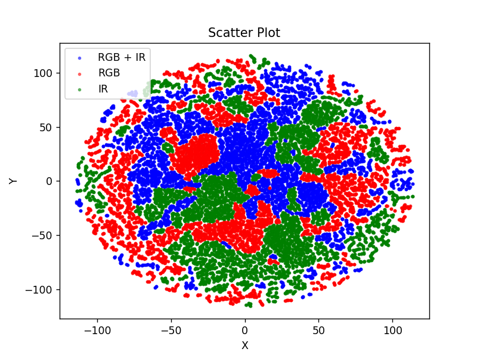
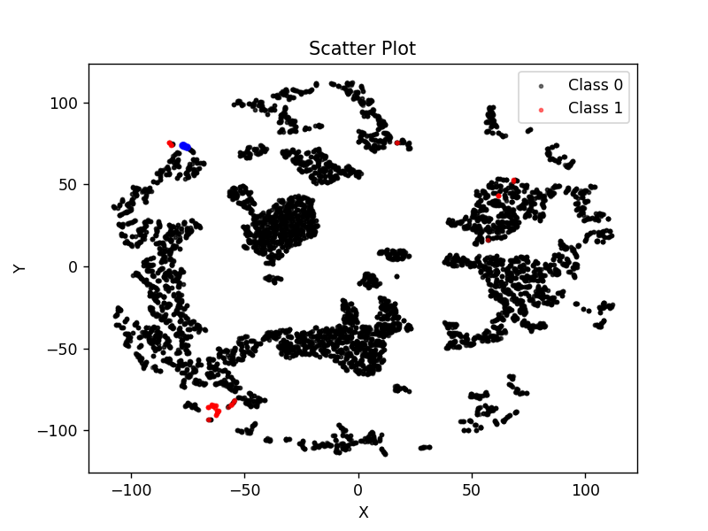
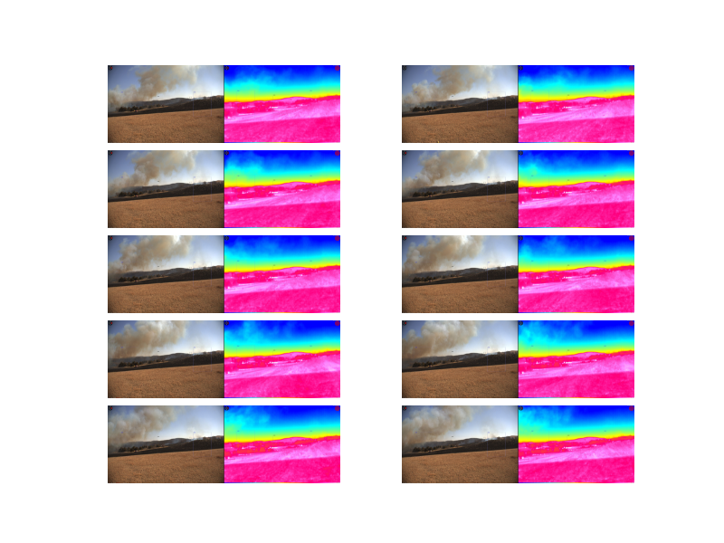

# KonzaBurn Post-Processing

This repository contains code and Jupyter notebooks used to **post-process** the classification results and internal representations produced by the [LLaVA-Based Wildfire Detection](https://github.com/waggle-sensor/HFSandbox) pipeline. The **KonzaBurn** dataset originates from a controlled burn event in 2022, during which **RGB** and **IR** images were collected and later classified to detect signs of wildfire.

## Overview

1. **Analyze_Output.ipynb**  
   - Reads classification results from `RESULTS/output.csv`  
   - Sorts images into “fire” vs. “no fire” categories based on predicted labels  
   - Displays a subset of images (resized) in a Jupyter environment for quick, manual review  
   - Demonstrates how to retrieve and print file paths and associated predictions

2. **Analyze Internal Rep.ipynb**  
   - Loads three internal representation tensors (`internal_rep.pt`, `rgb_internal_rep.pt`, `ir_internal_rep.pt`) created by the LLaVA-based pipeline  
   - Concatenates these representations to form a combined feature set  
   - Uses **t-SNE** (2D) to visualize the high-dimensional features in 2D space  
   - Plots scatter plots showing how **RGB+IR**, **RGB**, and **IR** embeddings cluster  
   - Reads predicted labels from `output.csv` to color-code scatter points (e.g., “fire” vs. “no fire”)  
   - Allows identification of **nearest neighbors** to a chosen coordinate in the 2D embedding space, displaying those images in a grid

## Repository Structure

```
KonzaBurn/
├── Analyze_Output.ipynb         # Notebook for reading and sorting classification results
├── Analyze Internal Rep.ipynb   # Notebook for t-SNE visualization and further analysis
├── RESULTS/
│   ├── output.csv               # Classification results from LLaVA-based detection
│   ├── checkpoint.txt           # List of processed files
│   ├── internal_rep.pt          # Internal embeddings for "RGB + IR"
│   ├── rgb_internal_rep.pt      # Internal embeddings for "RGB"
│   ├── ir_internal_rep.pt       # Internal embeddings for "IR"
│   └── ... (other logs or outputs)
├── images/                      # (Optional) Original images or a mounted path to them
└── README.md                    # This file
```

> **Note**: The actual folder names or paths (e.g., `images/`) may differ depending on how you organize your data. In some cases, you might mount or symlink an external directory containing the KonzaBurn images.

## Usage

1. **Clone or download** this repository:
   ```bash
   git clone https://github.com/your-username/KonzaBurn.git
   cd KonzaBurn
   ```

2. **Install prerequisites** (if not already available in your environment):
   - Python 3.8+  
   - Jupyter Notebook / JupyterLab  
   - Core Python libraries:
     ```bash
     pip install numpy pandas matplotlib pillow scikit-learn torch
     ```
   - Any additional libraries you need for your workflow.

3. **Launch the notebooks**:
   ```bash
   jupyter notebook
   ```
   - Open **Analyze_Output.ipynb** to explore the classification results and display sample images for “fire” vs. “no fire.”
   - Open **Analyze Internal Rep.ipynb** to visualize and investigate internal embeddings via t-SNE.

4. **Adjust settings**:
   - If your paths differ, modify the notebook variables such as `images_path` or `folder` to match your directory structure.
   - You can change the `start` and `segment` variables to limit the number of images displayed.

5. **Interpret the results**:
   - **Analyze_Output.ipynb**  
     - Lists all classified lines from `output.csv`.  
     - Filters “fire” lines (`fire_lines`) vs. “no_fire_lines` for easy manual checking.  
     - Displays images in a loop, printing predictions next to each image.  
   - **Analyze Internal Rep.ipynb**  
     - Shows how to read and combine the model’s internal representations (`int_rep`, `rgb_int_rep`, `ir_int_rep`).  
     - Uses t-SNE to reduce these embeddings to 2D, enabling scatter plots that color-code samples by predictions.  
     - Provides functionality to locate and display the nearest neighbors to a chosen point in the embedding space.

## Example Outputs

- **Fire vs. No-Fire Classification**  
  
  
- **t-SNE of RGB+IR, RGB, IR Embeddings**  
  

- **Nearest Neighbors Points**  
  

- **Nearest Neighbors Images**  
  

*(The actual images may differ, but the idea is to illustrate how results are displayed and analyzed.)*

## Contributing

1. Fork this repository.  
2. Create a branch for your changes.  
3. Make and test improvements.  
4. Create a pull request detailing your updates.

## Acknowledgments

- **LLaVA-Based Wildfire Detection** for the initial pipeline that generated classification outputs and embeddings.  
- The **KonzaBurn** controlled burn event, which provided a unique opportunity to gather real-world data for wildfire detection research.  

